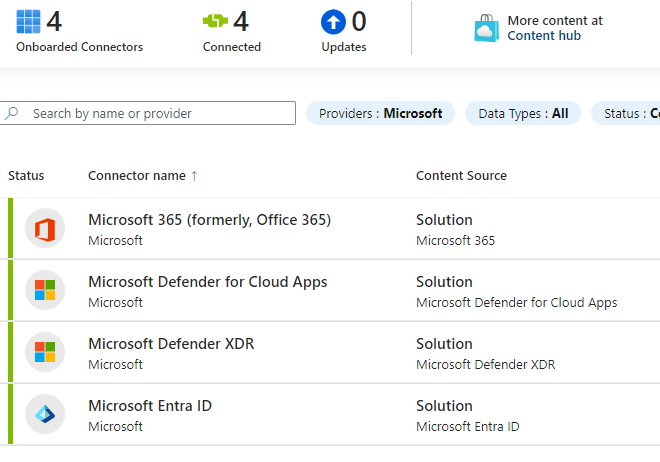
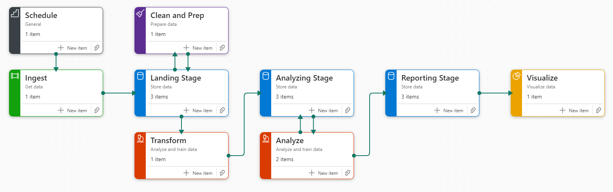
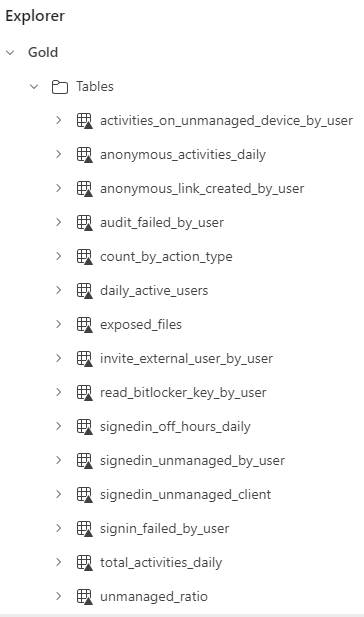
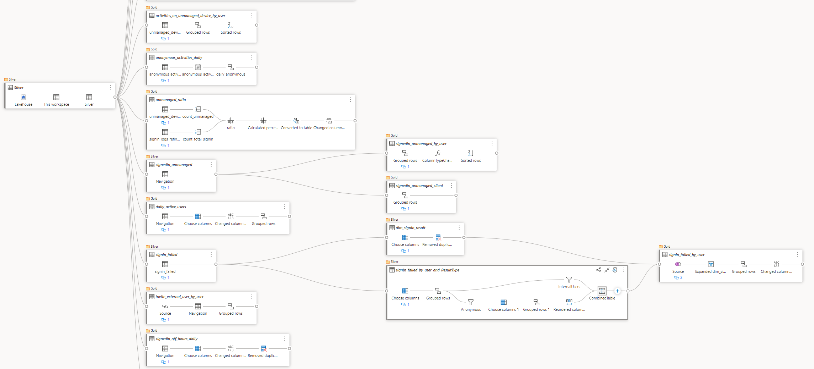
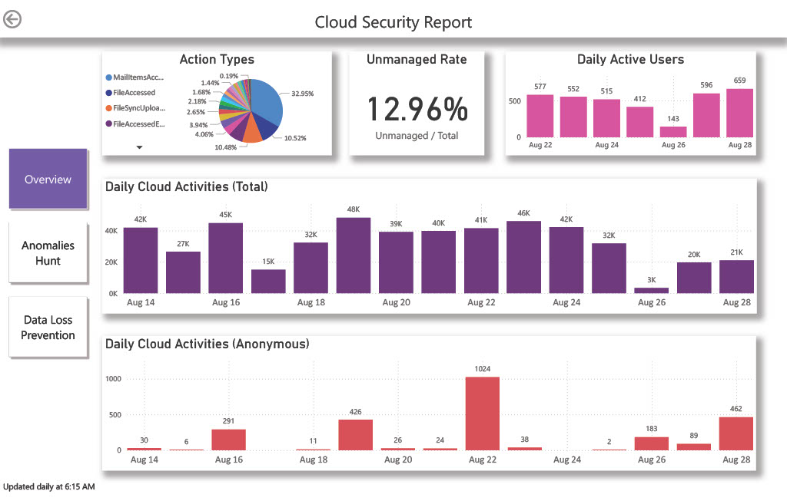
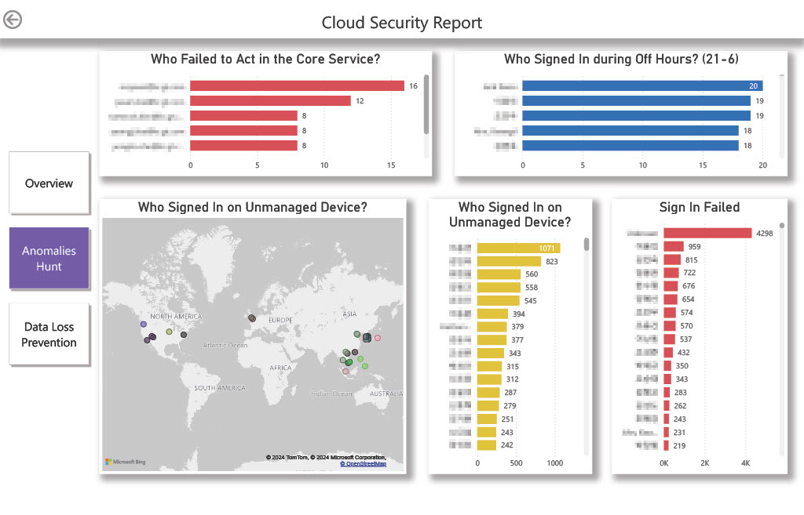

# Data Processing for Sentinel using Fabric
This repository contains a collection of Power Query M templates for processing security logs from Microsoft Sentinel using Microsoft Fabric (Data Flow gen 2).

### Diagram view of SignInFailedByUser for example.

- Technology: Microsoft Fabric, Microsoft Sentinel, Power BI
- Group: Grant Thornton Korea Accounting Firm
- People: 1
- duration: July 31, 2024 → August 30, 2024

### Objective

- Ingest, store for 6 months or more, and search the logs of the tenant using Azure Sentinel.
- Import the data into Microsoft Fabric so that it can be pre-processed and optimized.
- Visualize the data on Power BI dashboard to allow non-experts to perform anomaly detection and trend analysis

### My Role

Lead PoC planning and performing, and design the solution for demonstration.

**Cloud System Integration**

- Configure RBAC for log ingestion to Sentinel and data connection.
- Set ingestion scope and retention period as needed.

**Data Processing**

- After transferring to Fabric, parse nested data and standardization.
- Clean the data like garbage data and unused attributes.
- Design the data pipeline and optimize the cost.

**Analysis**

- Design the hunting scenarios according to security guidance.
- Discover trend insights and statistics of anomaly users.

### Design

**Log Ingestion**

Configure Data Connectors in Microsoft Sentinel. In this process, set the proper scope and ingest only needed logs so that it can minimize the cost.

**Data Flow**

**Schedule**

Trigger all the data flows by daily so that it can ingest new data and update the report everyday.

**Ingest**

Import the ingested JSON data from Sentinel into Lakehouse. In this process, I used REST API of Azure log analytic workspace. It has been configured to get the data only in last 24 hours from specific time.

**Clean and Prep**

Parse all nested data and standardize the types. Remove the garbage data (duplicates, nulls, or errors) and unused attributes.

**Landing Stage (Bronze)**

Stage the raw and initially cleaned data.

**Transform**

Choose attributes considering analyze scenarios. Append these data to **Analyzing Stage**.

**Analyzing Stage (Silver)**

Archive the previously cleaned and filtered data and store various ad hoc tables derived from it.

**Analyze**

Filter and aggregate the records using Power Query M in Data Flow Gen 2. Perform EDA in notebook as needed. Store the aggregated data that show enough meaningful information into **Reporting Stage.**

**Reporting Stage (Gold)**

Build data mart that analyst can access easily. Aggregate the data as much as possible to minimize the load for processing queries in Power BI.

**Visualize**

Show various cards that contains insights from the aggregated data using Power BI.

**Data Transform using Data Flow Gen 2**

Diagram view describes transforming and aggregating

**Visualize**

### Result

**Outcome Status Compared to Project Objective**

| **Objective** | **Status** |
| --- | --- |
| Target logs are being ingested and loaded properly. (Audit Log, SignIn Log, Cloud App Events) | ✅ Achieved |
| Data conneciton and RBAC have all been configured and integrated for the existing system. (Entra ID, Microsoft 365) | ✅ Achieved |
| Hunting scenarios have been setted based on security requirements. | ✅ Achieved |
| Scheduled data pipeline runs daily, and reports on visual dashboard. | ✅ Achieved |
| Clean the garbage data and export to the cost-efficient storage. (ADLS gen 2, Fabric OneLake) | ✅ Achieved |
| Data processing operations shall be idempotent and can be backfilled. | ❌ Limited |
| Insights can be derived from user anomaly activities and trend. | ✅ Achieved |
| The policies for DLP and threat protection have been established for next step. | ❌ Limited |
